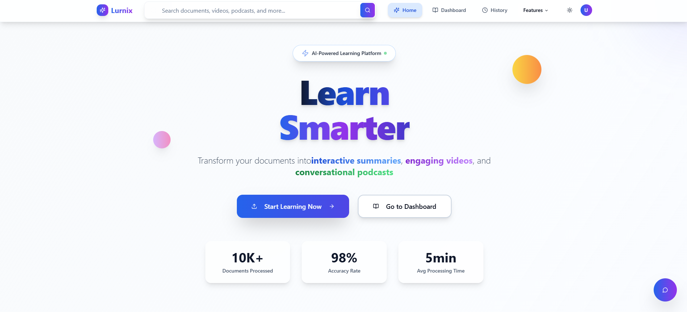
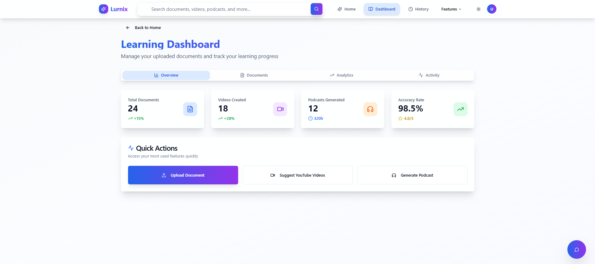
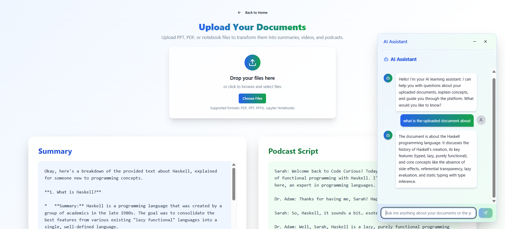
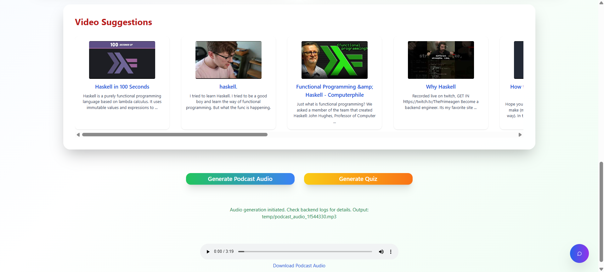

# Lurnix

Lurnix is an AI-powered learning and content transformation platform. It helps users learn smarter by leveraging advanced AI to summarize documents, generate quizzes, create podcasts, and suggest videos—all in one seamless experience.

---

## 🚀 Features

- **AI Summaries:** Instantly transform documents into concise, smart summaries.
- **Video Generation:** Create engaging videos from your content.
- **Podcast Creation:** Generate conversational podcasts from text.
- **Smart Analysis:** Advanced AI-powered content analysis for deeper insights.
- **Quiz Generation:** Automatically create quizzes from your uploaded materials.
- **User Dashboard:** Track your learning progress and manage your content.
- **Modern UI:** Responsive, beautiful interface built with React, Tailwind CSS, and shadcn-ui.

---

## 🖼️ App Samples

Below are some screenshots of Lurnix in action:

<p align="center">
  
  
  
  
</p>

---

## 🛠️ Tech Stack & Tools

- **Frontend:** React, TypeScript, Vite, Tailwind CSS, shadcn-ui
- **Backend:** Java Spring Boot
- **AI Integrations:** Google Gemini, ElevenLabs, Tesseract OCR, YouTube API
- **Database:** MySQL
- **Other:** Node.js, npm

---

## ⚙️ Installation & Setup

### Prerequisites
- **Node.js** (v16+ recommended)
- **npm**
- **Java** (17+ recommended)
- **Maven** (or use the provided wrapper scripts)
- **MySQL** (for backend database)

### 1. Clone the Repository
```sh
git clone <GIT_URL>
cd <PROJECT_NAME>
```

### 2. Install Frontend Dependencies
```sh
npm install
```

### 3. Start the Frontend
By default, the frontend runs on port **8000** (see `vite.config.ts`).
```sh
npm run dev
```

### 4. Setup & Run the Backend
Navigate to the `backend/` directory:
```sh
cd backend
```
Install dependencies and start the server:
```sh
# On Unix/Mac
./mvnw spring-boot:run
# On Windows
mvnw.cmd spring-boot:run
```
The backend runs on port **8080** by default.

### 5. Configure Environment Variables & API Keys
- Update `backend/src/main/resources/application.properties` with your API keys for Gemini, ElevenLabs, YouTube, and MySQL credentials.
- Ensure CORS settings in the backend allow requests from `http://localhost:8000`.

---

## 🌐 Accessing the App
- Open your browser and go to [http://localhost:8000](http://localhost:8000) to use the frontend.
- The frontend will communicate with the backend for all AI and data features.


---

## 🤝 Contributing
Pull requests are welcome! For major changes, please open an issue first to discuss what you would like to change.


